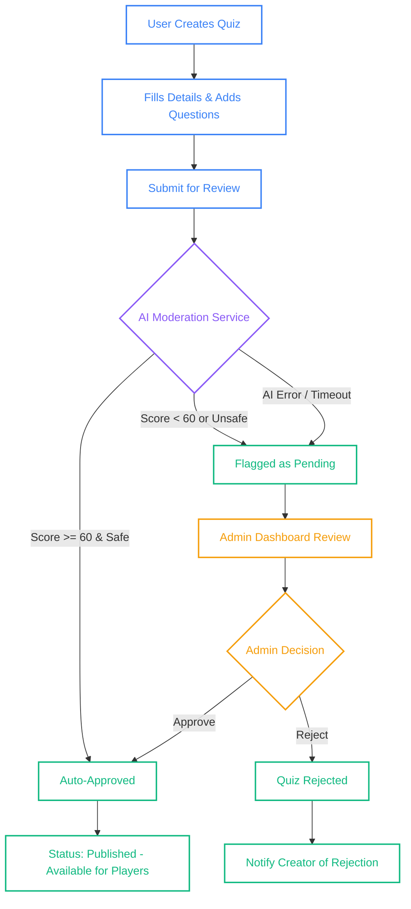
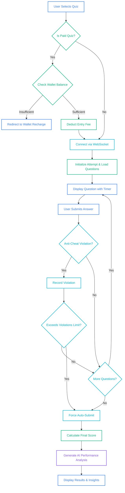
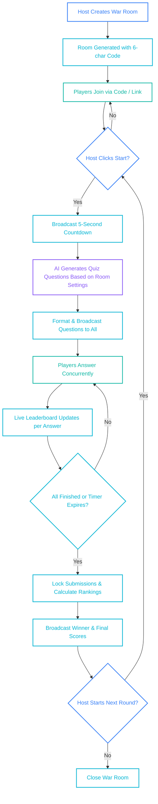
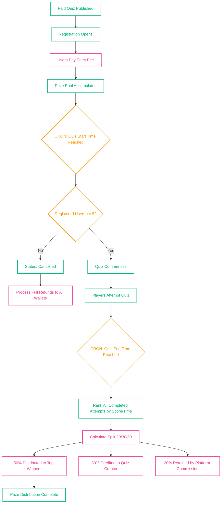
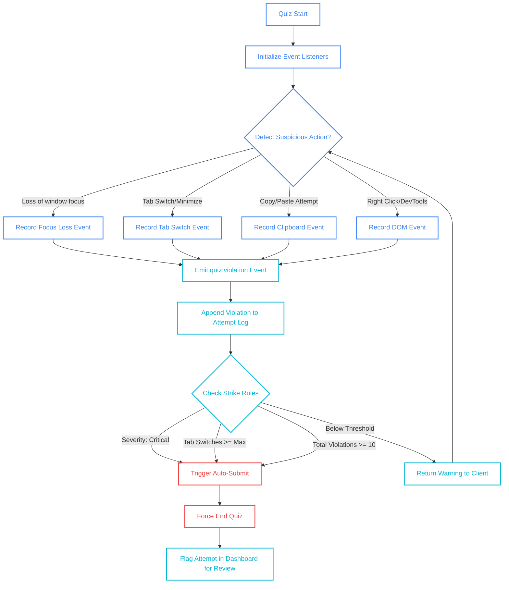
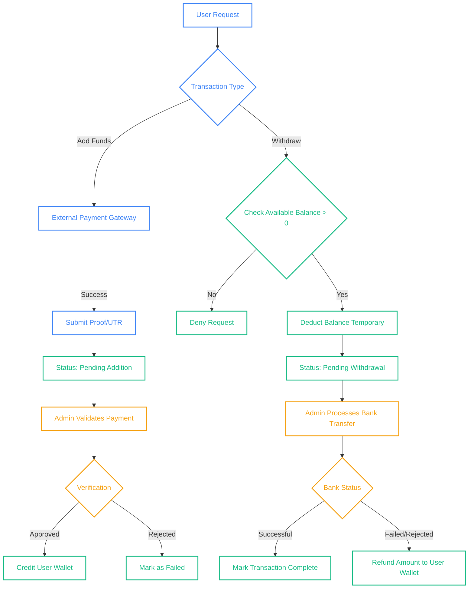

# Quiz Arena Architecture Flow Diagrams

Below are the 6 core flow diagrams illustrating the business logic and user journeys within Quiz Arena. You can paste these directly into markdown viewers that support Mermaid.js, or use [Mermaid Live Editor](https://mermaid.live/) to generate images from them.

---

### 1. Quiz Creation & Approval Flow
*Illustrates how a user creates a quiz, the AI moderation process, and the fallback to manual admin approval.*

---

### 2. Standard Quiz Attempt Flow (with Economic Checks)
*Shows the end-to-end journey of a user attempting a quiz, including wallet checks and WebSocket interactions.*

---

### 3. War Room Multiplayer Flow
*Details the real-time, real-time multiplayer lifecycle powered by WebSockets and OpenAI generation.*

---

### 4. Paid Quiz Economy & Cron Lifecycle
*Maps the timeline-based logic of paid quizzes, minimum participant rules, and the 20/30/50 profit distribution.*

---

### 5. Anti-Cheat Monitoring Flow
*Shows the strict client-to-server security mechanisms during an active quiz session.*

---

### 6. Wallet Recharge & Withdrawal Flow
*Shows how monetary transactions move through the system and admin verification.*

